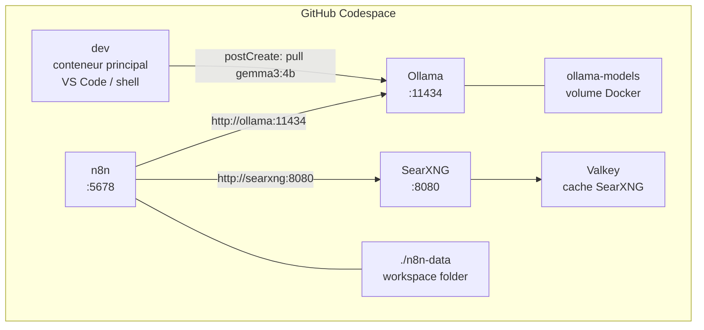

# Configuration GitHub Codespace — Stack IA (Ollama + n8n + SearXNG)

## Architecture



## Fichiers a creer

- `.devcontainer/devcontainer.json` — config principale (hostRequirements, ports labels, initializeCommand, postCreateCommand, postStartCommand)
- `.devcontainer/docker-compose.yml` — 5 services, `env_file: .env`, healthchecks, restart
- `.devcontainer/initializeCommand.sh` — tourne sur l'**hote** avant `docker compose up` ; ecrit `.devcontainer/.env` avec les variables Codespaces et genere les cles si absentes
- `.devcontainer/.env.example` — template commite avec cles vides (documentation)
- `.devcontainer/ollama-entrypoint.sh` — entrypoint Ollama avec `set +e` autour de la boucle, retry pull x3
- `.devcontainer/postCreate.sh` — attente services + affichage URLs (execution unique a la creation)
- `.devcontainer/postStart.sh` — reaffichage des URLs a chaque reprise du codespace
- `.devcontainer/searxng/settings.yml` — API JSON, Valkey, moteurs
- `.devcontainer/searxng/limiter.toml` — rate-limiting desactive
- `.devcontainer/searxng/uwsgi.ini` — pre-cree pour eviter echec de demarrage
- `n8n-data/.gitkeep` — cree le dossier dans le repo
- `.gitignore` — ignore `.devcontainer/.env` et contenu de `n8n-data/`

## Services Docker Compose

**dev** (conteneur principal VS Code)
- Image : `mcr.microsoft.com/devcontainers/base:ubuntu-24.04`
- Mount workspace : `/workspaces/...`
- `command: sleep infinity`
- `restart: unless-stopped`

**ollama**
- Image : `ollama/ollama:latest`
- Volumes :
  - `ollama-models:/root/.ollama` (modeles persistes)
  - `.:/devcontainer:ro` (monte `.devcontainer/` dans le conteneur pour acceder au script)
- `entrypoint: ["/devcontainer/ollama-entrypoint.sh"]`
- Healthcheck : `ollama list`
- `restart: unless-stopped`

**n8n**
- Image : `docker.n8n.io/n8nio/n8n:latest`
- Volume : `../n8n-data:/home/node/.n8n`
- `user: "1000:1000"`
- `env_file: .env` (lit `N8N_ENCRYPTION_KEY`, `WEBHOOK_URL`)
- Variables complementaires dans docker-compose :
  - `N8N_PROXY_HOPS=1`
  - `GENERIC_TIMEZONE=UTC`
- `depends_on: [valkey, searxng]` — sans `condition: service_healthy` (n8n demarre en parallele, ne bloque pas sur la sante de searxng qu'il n'utilise qu'a la demande)
- `restart: unless-stopped`

**valkey**
- Image : `valkey/valkey:8-alpine`
- `restart: unless-stopped`
- Healthcheck : `valkey-cli ping`, `interval: 5s`, `retries: 5`

**searxng**
- Image : `searxng/searxng:latest`
- Volume : `./searxng:/etc/searxng`
- `uwsgi.ini` pre-cree dans `.devcontainer/searxng/`
- `env_file: .env` (lit `SEARXNG_SECRET_KEY`)
- `SEARXNG_BASE_URL=http://localhost:8080/`
- `restart: unless-stopped`
- Healthcheck : `wget -q --spider http://localhost:8080/healthz` → permet le `condition: service_healthy` de n8n
- `depends_on: {valkey: {condition: service_healthy}}`

## Ports transferes et nommes (devcontainer.json)

`forwardPorts` avec format `"service:port"` pour les services secondaires :

```json
"forwardPorts": [5678, "ollama:11434", "searxng:8080"],
"portsAttributes": {
  "5678":          { "label": "n8n UI",     "onAutoForward": "notify" },
  "ollama:11434":  { "label": "Ollama API", "onAutoForward": "silent" },
  "searxng:8080":  { "label": "SearXNG",    "onAutoForward": "silent" }
}
```

- `onAutoForward: notify` sur n8n → notification ballon quand le port est disponible, l'utilisateur choisit quand ouvrir (evite la page d'erreur si n8n pas encore pret)
- `onAutoForward: silent` sur Ollama et SearXNG → ports transferes sans notification

## Points cles de configuration et garde-fous

**`devcontainer.json`**
- `"hostRequirements": {"memory": "8gb", "cpus": 4}`
- `"initializeCommand": "bash .devcontainer/initializeCommand.sh"` — tourne sur l'**hote** avant compose
- `"postCreateCommand": "bash .devcontainer/postCreate.sh"` — une seule fois a la creation
- `"postStartCommand": "bash .devcontainer/postStart.sh"` — a chaque reprise
- Plus de `remoteEnv` : les variables passent par le fichier `.env` ecrit par `initializeCommand.sh`

**`initializeCommand.sh` — cœur de la robustesse des secrets**
Tourne sur l'hote avant `docker compose up`. Priorite aux **GitHub Codespaces Secrets** (injectees comme variables d'env sur le VM hote) :
```bash
#!/bin/bash
ENV_FILE="$(dirname "$0")/.env"
# Idempotent : ne pas ecraser si .env existe (reprise codespace)
if [ ! -f "$ENV_FILE" ]; then
  # Priorite 1 : GitHub Codespaces Secret → stable entre recreations
  # Priorite 2 : generation aleatoire locale → perdue si codespace supprime
  N8N_KEY="${N8N_ENCRYPTION_KEY:-$(openssl rand -hex 32)}"
  SRX_KEY="${SEARXNG_SECRET_KEY:-$(openssl rand -hex 32)}"
  if [ -n "${CODESPACE_NAME:-}" ]; then
    WEBHOOK="https://${CODESPACE_NAME}-5678.${GITHUB_CODESPACES_PORT_FORWARDING_DOMAIN}/"
  else
    WEBHOOK="http://localhost:5678/"
  fi
  cat > "$ENV_FILE" <<EOF
N8N_ENCRYPTION_KEY=${N8N_KEY}
SEARXNG_SECRET_KEY=${SRX_KEY}
WEBHOOK_URL=${WEBHOOK}
EOF
fi
```
- Si `N8N_ENCRYPTION_KEY` est definie comme **GitHub Codespaces Secret** → cle stable sur toutes les recreations du codespace → credentials n8n toujours lisibles
- Si non definie → cle generee aleatoirement → credentials perdues si le codespace est supprime (comportement documente dans le README)
- `.devcontainer/.env` toujours dans `.gitignore`

**`ollama-entrypoint.sh` — logique de robustesse corrigee**
```bash
#!/bin/bash
# set -e desactive uniquement pour la boucle d'attente
ollama serve &
SERVE_PID=$!
set +e
until ollama list > /dev/null 2>&1; do sleep 1; done
set -e
# Retry pull x3
MAX=3; COUNT=0
until ollama pull gemma3:4b; do
  COUNT=$((COUNT+1))
  [ "$COUNT" -ge "$MAX" ] && echo "ERREUR: pull gemma3:4b echoue apres $MAX tentatives" && exit 1
  echo "Retry $COUNT/$MAX dans 5s..."; sleep 5
done
wait "$SERVE_PID"
```

**`postCreate.sh`** : `set -euo pipefail`, attend `http://n8n:5678` (nom DNS Compose, **pas** `localhost`) avec timeout 120s, affiche URLs finales avec detection Codespaces vs local

**`postStart.sh`** : leger, reaffiche uniquement les URLs a chaque ouverture du codespace

**SearXNG `settings.yml`** : `use_default_settings: true` + `formats: [html, json]` + `redis.url: redis://valkey:6379/0`

**SearXNG `limiter.toml`** : desactive `[real_ip]` et `[botdetection]`

**SearXNG `uwsgi.ini`** : pre-cree (config minimale uwsgi)

**Appels inter-services depuis n8n**
- Ollama REST : `http://ollama:11434/api/generate`
- Ollama OpenAI-compatible : `http://ollama:11434/v1`
- SearXNG : `http://searxng:8080/search?q=...&format=json`

**`.gitignore` — ce qui est ignore**
- `.devcontainer/.env` (cles secretes)
- `n8n-data/*.sqlite` et `n8n-data/*.db` (base SQLite binaire, change a chaque execution → bloat git)
- `n8n-data/binaryData/` (uploads binaires de n8n)
- `ollama-models/` (volume Docker, pas dans le workspace)
- Seul `n8n-data/.gitkeep` est commite pour creer le dossier

**Avertissement README — persistance et securite**

Tableau de persistance clair pour l'utilisateur :

| Donnee | Persiste entre suspensions | Persiste apres suppression codespace |
|---|---|---|
| Modele Ollama (volume) | Oui | Non (~3.3 Go a retelecharger) |
| Workflows n8n (n8n-data/) | Oui (git) | Oui (git) |
| Credentials n8n (chiffrees) | Oui (git) | **Oui seulement si N8N_ENCRYPTION_KEY est un GitHub Secret** |
| `.devcontainer/.env` | Oui (VM) | Non (regenere) |

**Action requise avant de creer le codespace** (documentee dans README) :
Aller dans `Settings > Secrets and variables > Codespaces` du repo GitHub et ajouter :
- `N8N_ENCRYPTION_KEY` = valeur hex 32 octets generee une fois (`openssl rand -hex 32`)
- `SEARXNG_SECRET_KEY` = valeur hex 32 octets generee une fois
